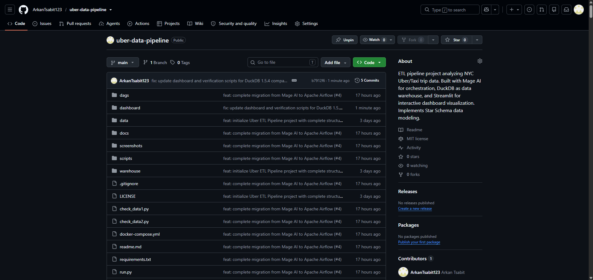
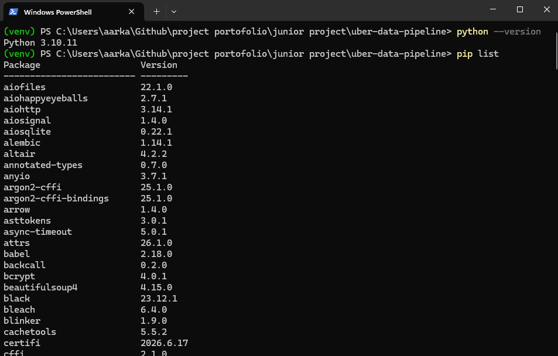
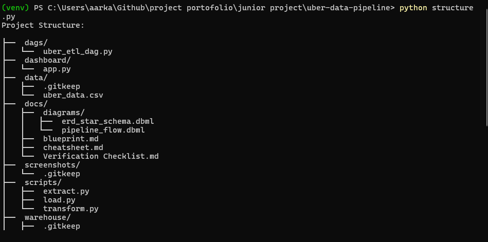
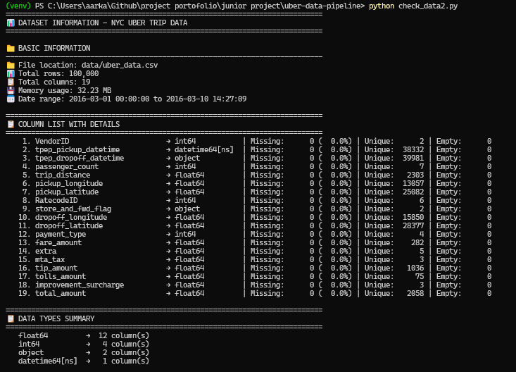
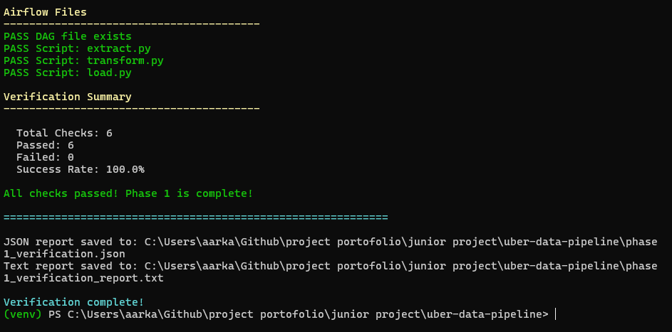

# 🚖 Uber ETL Pipeline Project

[](https://www.python.org/downloads/)
[](https://www.mage.ai/)
[](https://duckdb.org/)
[](https://streamlit.io/)
[](https://plotly.com/)
[](https://opensource.org/licenses/MIT)

---

## 📋 Table of Contents

- [Project Overview](#-project-overview)
- [Architecture](#-architecture)
- [Tech Stack](#-tech-stack)
- [Star Schema Design](#-star-schema-design)
- [Pipeline Phases](#-pipeline-phases)
- [Project Structure](#-project-structure)
- [Quick Start](#-quick-start)
- [Dashboard Preview](#-dashboard-preview)
- [Business Questions Answered](#-business-questions-answered)
- [Verification & Testing](#-verification--testing)
- [Screenshots](#-screenshots)
- [Troubleshooting](#-troubleshooting)
- [Contributing](#-contributing)
- [License](#-license)

---

## 🎯 Project Overview

This project implements an **end-to-end data pipeline** for analyzing NYC Uber/Taxi trip data using a **modern open-source stack** that runs entirely on your local machine.

### Key Features

- ✅ **Modular ETL Pipeline** built with Mage AI
- ✅ **Star Schema Data Warehouse** in DuckDB (4 tables)
- ✅ **Interactive Dashboard** with Streamlit + Plotly
- ✅ **115+ Automated Verification Checks** across 6 phases
- ✅ **Comprehensive Documentation** with 32+ screenshots

### Business Questions Addressed

- What are the peak hours for ride demand?
- How does revenue pattern vary by day of the week?
- Which rate codes are most frequently used?
- What are the average trip distance and revenue per trip?
- How do passenger counts affect fare amounts?
- What is the distribution of payment types?

---

## 🏗️ Architecture

### Pipeline Flow Diagram

```
┌─────────────────────────────────────────────────────────────────────┐
│                       UBER ETL PIPELINE                            │
├─────────────────────────────────────────────────────────────────────┤
│                                                                     │
│  ┌──────────────┐   ┌──────────────┐   ┌──────────────┐           │
│  │   EXTRACT    │   │  TRANSFORM   │   │    LOAD      │           │
│  │              │   │              │   │              │           │
│  │  Data Loader │──▶│ Transformer  │──▶│ Data Exporter│           │
│  │  (Mage AI)   │   │  (Mage AI)   │   │  (Mage AI)   │           │
│  └──────────────┘   └──────────────┘   └──────────────┘           │
│         │                  │                  │                    │
│         ▼                  ▼                  ▼                    │
│  ┌──────────────┐   ┌──────────────┐   ┌──────────────┐           │
│  │  Raw CSV     │   │ Star Schema  │   │   DuckDB     │           │
│  │  Dataset     │   │  (4 Tables)  │   │  Warehouse   │           │
│  └──────────────┘   └──────────────┘   └──────────────┘           │
│                                                      │             │
│                                                      ▼             │
│                                             ┌──────────────┐       │
│                                             │  Streamlit   │       │
│                                             │  Dashboard   │       │
│                                             └──────────────┘       │
│                                                                     │
└─────────────────────────────────────────────────────────────────────┘
```

---

## 🛠️ Tech Stack

| Component | Technology | Version | Purpose |
|-----------|-----------|---------|---------|
| **Orchestration** | Mage AI | 0.9.70 | Pipeline orchestration with modular blocks |
| **Data Warehouse** | DuckDB | 0.9.2 | In-process OLAP database |
| **Dashboard** | Streamlit | 1.29.0 | Interactive web application |
| **Visualization** | Plotly | 5.18.0 | Interactive charting |
| **Data Processing** | Pandas | 2.1.4 | Data manipulation and transformation |
| **Language** | Python | 3.10+ | Primary programming language |

---

## 📊 Star Schema Design

### Entity-Relationship Diagram

```
┌─────────────────────┐          ┌─────────────────────────┐
│    datetime_dim     │          │     rate_code_dim       │
├─────────────────────┤          ├─────────────────────────┤
│ datetime_id (PK)    │◄─────┐   │ rate_code_id (PK)       │◄─────┐
│ pickup_datetime     │      │   │ RatecodeID              │      │
│ pick_hour           │      │   │ rate_code_name          │      │
│ pick_day            │      │   └─────────────────────────┘      │
│ pick_month          │      │                                     │
│ pick_year           │      │                                     │
│ pick_weekday        │      │                                     │
└─────────────────────┘      │                                     │
                              │    ┌──────────────────────────────┐│
                              └────┤        fact_table            ││
                                   ├──────────────────────────────┤│
                                   │ trip_id (PK)                 ││
                                   │ datetime_id (FK)             │─┘
                                   │ rate_code_id (FK)            │─┐
                                   │ pickup_location_id (FK)      │ │
                                   │ dropoff_location_id (FK)     │ │
                                   │ trip_distance                │ │
                                   │ fare_amount                  │ │
                                   │ total_amount                 │ │
                                   └──────────────────────────────┘ │
                              ┌─────────────────────────┐          │
                              │     location_dim        │          │
                              ├─────────────────────────┤          │
                              │ location_id (PK)        │◄─────────┘
                              │ location_name           │
                              │ borough                 │
                              └─────────────────────────┘
```

### Table Definitions

#### 1. datetime_dim (Dimension Table)

| Column | Type | Description |
|--------|------|-------------|
| `datetime_id` | INTEGER | Primary Key (auto-increment) |
| `pickup_datetime` | TIMESTAMP | Exact pickup timestamp |
| `pick_hour` | INTEGER | Hour of day (0-23) |
| `pick_day` | INTEGER | Day of month (1-31) |
| `pick_month` | INTEGER | Month (1-12) |
| `pick_year` | INTEGER | Year |
| `pick_weekday` | VARCHAR | Day name (Monday-Sunday) |

#### 2. rate_code_dim (Dimension Table)

| Column | Type | Description |
|--------|------|-------------|
| `rate_code_id` | INTEGER | Primary Key (auto-increment) |
| `RatecodeID` | INTEGER | Rate code ID from dataset |
| `rate_code_name` | VARCHAR | Human-readable rate name |

**Rate Code Mapping:**
| RatecodeID | Name |
|------------|------|
| 1 | Standard |
| 2 | JFK |
| 3 | Newark |
| 4 | Nassau/Westchester |
| 5 | Negotiated |
| 6 | Group Ride |

#### 3. location_dim (Dimension Table)

| Column | Type | Description |
|--------|------|-------------|
| `location_id` | INTEGER | Primary Key (auto-increment) |
| `location_name` | VARCHAR | NYC zone name |
| `borough` | VARCHAR | Borough (Manhattan, Brooklyn, etc.) |

#### 4. fact_table (Fact Table)

| Column | Type | Description |
|--------|------|-------------|
| `trip_id` | INTEGER | Primary Key (auto-increment) |
| `datetime_id` | INTEGER | FK → datetime_dim |
| `rate_code_id` | INTEGER | FK → rate_code_dim |
| `pickup_location_id` | INTEGER | FK → location_dim |
| `dropoff_location_id` | INTEGER | FK → location_dim |
| `trip_distance` | FLOAT | Trip distance (miles) |
| `trip_duration` | FLOAT | Trip duration (minutes) |
| `fare_amount` | FLOAT | Fare amount ($) |
| `total_amount` | FLOAT | Total amount with tips/tolls ($) |
| `passenger_count` | INTEGER | Number of passengers |
| `payment_type_id` | INTEGER | Payment type (1=Credit, 2=Cash, etc.) |

---

## 📋 Pipeline Phases

### Phase 1: Setup & Environment
Establish the foundation for the project.

| # | Task | Detail |
|---|------|--------|
| 1.1 | Folder structure | Create `data/`, `warehouse/`, `dashboard/`, `mage_project/` |
| 1.2 | Virtual environment | `python -m venv venv` |
| 1.3 | Requirements | Install `mage-ai`, `duckdb`, `pandas`, `streamlit`, `plotly` |
| 1.4 | Dataset | Download `uber_data.csv` to `data/` |
| 1.5 | Verification | `python verify-phase-1.py` (14 checks) |

### Phase 2: Data Loading (Extract)
Load CSV data into Mage AI.

| # | Task | Detail |
|---|------|--------|
| 2.1 | Start Mage | `mage start mage_project` |
| 2.2 | Create pipeline | `uber_etl_pipeline` (Standard batch) |
| 2.3 | Data Loader block | Name: `load_data` |
| 2.4 | Code validation | `@data_loader`, pandas, `pd.read_csv()` |
| 2.5 | Run block | Test execution |
| 2.6 | Verification | `python verify-phase-2.py` (12 checks) |

### Phase 3: Data Transformation (Transform)
Build the Star Schema.

| # | Task | Detail |
|---|------|--------|
| 3.1 | Transformer block | Name: `create_star_schema` |
| 3.2 | Data cleaning | `drop_duplicates()`, `dropna()`, `reset_index()` |
| 3.3 | Build `datetime_dim` | Extract temporal components |
| 3.4 | Build `rate_code_dim` | Map rate codes to names |
| 3.5 | Build `location_dim` | Create unique locations |
| 3.6 | Build `fact_table` | Combine all dimensions |
| 3.7 | Return dictionary | `{'datetime_dim': ..., 'rate_code_dim': ..., 'location_dim': ..., 'fact_table': ...}` |
| 3.8 | Verification | `python verify-phase-3.py` (32 checks) |

### Phase 4: Data Loading to DuckDB (Load)
Store transformed data in DuckDB.

| # | Task | Detail |
|---|------|--------|
| 4.1 | Data Exporter block | Name: `load_to_duckdb` |
| 4.2 | Import DuckDB | `import duckdb` |
| 4.3 | Connect to DB | `duckdb.connect('warehouse/uber.duckdb')` |
| 4.4 | Drop & Create tables | `DROP TABLE IF EXISTS`, `CREATE TABLE` |
| 4.5 | Loop tables | Iterate through `data.items()` |
| 4.6 | Create view | `trip_analytics` for dashboard |
| 4.7 | Run pipeline | Execute all 3 blocks |
| 4.8 | Verification | `python verify-phase-4.py` (15 checks) |

### Phase 5: Dashboard Development
Build an interactive visualization dashboard.

| # | Task | Detail |
|---|------|--------|
| 5.1 | Create `dashboard/app.py` | Streamlit application |
| 5.2 | Import libraries | `streamlit`, `duckdb`, `pandas`, `plotly` |
| 5.3 | Database connection | `@st.cache_resource` |
| 5.4 | Data loading | `@st.cache_data` |
| 5.5 | KPI Cards | Total Trips, Revenue, Avg Distance, Avg Fare |
| 5.6 | Line Chart | Revenue per Hour |
| 5.7 | Bar Chart | Trips by Weekday |
| 5.8 | Pie Chart | Rate Code Distribution |
| 5.9 | Scatter Plot | Distance vs Fare |
| 5.10 | Sidebar filters | Year, Month, Weekday |
| 5.11 | Data table | `st.dataframe()` |
| 5.12 | Run dashboard | `streamlit run dashboard/app.py` |
| 5.13 | Verification | `python verify-phase-5.py` (23 checks) |

### Phase 6: Deployment & Documentation
Finalize the project.

| # | Task | Detail |
|---|------|--------|
| 6.1 | README.md | Comprehensive project documentation |
| 6.2 | Screenshots | 32+ screenshots in `screenshots/` |
| 6.3 | Git init | `git init` |
| 6.4 | GitHub repo | Create public repository |
| 6.5 | Push | `git push origin main` |
| 6.6 | Verification | `python verify-phase-6.py` (19 checks) |

---

## 📁 Project Structure

```
uber-data-pipeline/
│
├── 📁 dashboard/
│   └── app.py                         # Streamlit dashboard application
│
├── 📁 data/
│   └── uber_data.csv                  # Raw NYC Uber/Taxi dataset
│
├── 📁 warehouse/
│   └── uber.duckdb                    # DuckDB database file
│
├── 📁 mage_project/
│   ├── metadata.yaml                  # Mage AI configuration
│   └── pipelines/
│       └── uber_etl_pipeline/
│           ├── pipeline.yaml          # Pipeline configuration
│           └── blocks/
│               ├── load_data.py       # Data Loader (Extract)
│               ├── create_star_schema.py  # Transformer (Transform)
│               └── load_to_duckdb.py      # Data Exporter (Load)
│
├── 📁 screenshots/
│   └── (32+ verification screenshots)
│
├── 📄 verify-phase-1.py               # Phase 1: Setup Verification
├── 📄 verify-phase-2.py               # Phase 2: Extract Verification
├── 📄 verify-phase-3.py               # Phase 3: Transform Verification
├── 📄 verify-phase-4.py               # Phase 4: Load Verification
├── 📄 verify-phase-5.py               # Phase 5: Dashboard Verification
├── 📄 verify-phase-6.py               # Phase 6: Deployment Verification
│
├── 📄 requirements.txt                # Python dependencies
├── 📄 .gitignore                      # Git ignore file
├── 📄 LICENSE                         # MIT License
└── 📄 README.md                       # Documentation (this file)
```

---

## 🚀 Quick Start

### Prerequisites

- Python 3.10 or higher
- Git (optional, for cloning)
- Virtual environment (recommended)

### Installation Steps

```bash
# 1. Clone the repository
git clone https://github.com/yourusername/uber-data-pipeline.git
cd uber-data-pipeline

# 2. Create and activate virtual environment
python -m venv venv
source venv/bin/activate          # On Windows: venv\Scripts\activate

# 3. Install dependencies
pip install --upgrade pip
pip install -r requirements.txt

# 4. Verify setup
python verify-phase-1.py

# 5. Start Mage AI
mage start mage_project

# 6. Open Mage UI in browser
# http://localhost:6789

# 7. Create pipeline in Mage UI
# - Create pipeline: uber_etl_pipeline
# - Add 3 blocks: Data Loader, Transformer, Data Exporter
# - Copy code from respective .py files in blocks/

# 8. Run the pipeline
# Click "Run pipeline" in Mage UI

# 9. Verify each phase
python verify-phase-2.py
python verify-phase-3.py
python verify-phase-4.py
python verify-phase-5.py
python verify-phase-6.py

# 10. Launch the dashboard
streamlit run dashboard/app.py
```

### Dashboard Access

Once running, open your browser and navigate to:
```
http://localhost:8501
```

---

## 📊 Dashboard Preview

The Streamlit dashboard provides the following visualizations:

### Key Performance Indicators (KPIs)
- **Total Trips**: Count of all trips
- **Total Revenue**: Sum of all fares
- **Average Distance**: Mean trip distance
- **Average Fare**: Mean fare amount

### Interactive Charts
1. **Revenue Over Time** (Line Chart)
   - Hourly revenue patterns
   - Day-over-day trends

2. **Trips by Weekday** (Bar Chart)
   - Peak day identification
   - Weekend vs weekday analysis

3. **Rate Code Distribution** (Pie Chart)
   - Most common rate codes
   - Percentage breakdown

4. **Distance vs Fare** (Scatter Plot)
   - Correlation analysis
   - Outlier detection

### Filters
- **Year**: Filter by year
- **Month**: Filter by month
- **Weekday**: Filter by day of week
- **Rate Code**: Filter by rate code

---

## ❓ Business Questions Answered

### 1. When is demand highest?
**Query**: Analyze `pick_hour` and `pick_weekday` from `datetime_dim` joined with `fact_table`.

### 2. How does revenue vary by day?
**Query**: Group by `pick_weekday`, sum `total_amount` from `fact_table`.

### 3. Which rate codes are most common?
**Query**: Join `rate_code_dim` with `fact_table`, count by `rate_code_name`.

### 4. What are average trip metrics?
**Query**: Calculate AVG of `trip_distance` and `total_amount` from `fact_table`.

### 5. How does passenger count affect fare?
**Query**: Group by `passenger_count`, calculate AVG `fare_amount`.

### 6. What is the payment type distribution?
**Query**: Group by `payment_type_id`, calculate percentage.

### Sample Query

```sql
-- View trip analytics with all dimensions
CREATE VIEW trip_analytics AS
SELECT 
    f.trip_id,
    f.trip_distance,
    f.fare_amount,
    f.total_amount,
    f.passenger_count,
    d.pickup_datetime,
    d.pick_hour,
    d.pick_weekday,
    d.pick_month,
    d.pick_year,
    r.rate_code_name,
    pl.location_name AS pickup_location,
    dl.location_name AS dropoff_location,
    pl.borough AS pickup_borough
FROM fact_table f
LEFT JOIN datetime_dim d ON f.datetime_id = d.datetime_id
LEFT JOIN rate_code_dim r ON f.rate_code_id = r.rate_code_id
LEFT JOIN location_dim pl ON f.pickup_location_id = pl.location_id
LEFT JOIN location_dim dl ON f.dropoff_location_id = dl.location_id;
```

---

## ✅ Verification & Testing

### Verification Summary

| Phase | Script | Checks | Focus |
|-------|--------|--------|-------|
| **1** | `verify-phase-1.py` | 14 | Setup & Environment |
| **2** | `verify-phase-2.py` | 12 | Data Loading (Extract) |
| **3** | `verify-phase-3.py` | 32 | Data Transformation (Star Schema) |
| **4** | `verify-phase-4.py` | 15 | Data Loading to DuckDB |
| **5** | `verify-phase-5.py` | 23 | Dashboard Development |
| **6** | `verify-phase-6.py` | 19 | Deployment & Documentation |
| **TOTAL** | | **115** | **All Phases** |

### Run All Verifications

```bash
for i in {1..6}; do python verify-phase-$i.py; done
```

---

## 📸 Screenshots

### Phase 0: Repository & Setup

| Screenshot | Description |
|------------|-------------|
|  | GitHub repository created |
|  | Terminal with venv active |

### Phase 1: Environment Setup

| Screenshot | Description |
|------------|-------------|
|  | Project folder structure |
|  | Dataset in data/ folder |
|  | Phase 1 verification passed (100%) |

### Phase 2: Data Extraction

| Screenshot | Description |
|------------|-------------|
|  | Mage AI UI dashboard |
|  | Data Loader block in Mage |
|  | Loader block execution success |
|  | Phase 2 verification passed |

### Phase 3: Data Transformation

| Screenshot | Description |
|------------|-------------|
|  | Transformer block in Mage |
|  | Transformer block execution success |
|  | Phase 3 verification passed |

### Phase 4: Data Loading

| Screenshot | Description |
|------------|-------------|
|  | Data Exporter block in Mage |
|  | Exporter block execution success |
|  | Full pipeline success (all green) |
|  | Phase 4 verification passed |
|  | DuckDB tables view |
|  | DuckDB sample data |

### Phase 5: Dashboard Development

| Screenshot | Description |
|------------|-------------|
|  | Dashboard application code |
|  | Dashboard overview |
|  | Sidebar filters |
|  | All interactive charts |
|  | KPI cards |
|  | Dashboard with filter applied |
|  | Phase 5 verification passed |

### Phase 6: Deployment

| Screenshot | Description |
|------------|-------------|
|  | README.md overview |
|  | Screenshots folder |
|  | Phase 6 verification passed |
|  | Git commit |
|  | Git push |
|  | Final GitHub repository |
|  | README.md rendered on GitHub |

---

## 🔧 Troubleshooting

### Common Issues and Solutions

| Issue | Solution |
|-------|----------|
| `ModuleNotFoundError` | Run `pip install -r requirements.txt --upgrade` |
| Database connection error | Verify `warehouse/uber.duckdb` exists and has data |
| Mage server won't start | Check if port 6789 is available; try `mage stop` first |
| Dashboard not loading | Upgrade Streamlit: `pip install streamlit --upgrade` |
| Verification fails | Ensure you've completed all tasks for that phase |
| CSV file not found | Place `uber_data.csv` in the `data/` directory |
| Memory issues | Reduce dataset size or increase memory limit |

### Getting Help

- **Mage AI Documentation**: https://docs.mage.ai/
- **DuckDB Documentation**: https://duckdb.org/docs/
- **Streamlit Documentation**: https://docs.streamlit.io/
- **Plotly Documentation**: https://plotly.com/python/

---

## 🤝 Contributing

Contributions are welcome! Please follow these steps:

1. Fork the repository
2. Create a feature branch (`git checkout -b feature/AmazingFeature`)
3. Commit your changes (`git commit -m 'Add some AmazingFeature'`)
4. Push to the branch (`git push origin feature/AmazingFeature`)
5. Open a Pull Request

### Development Guidelines

- Follow PEP 8 coding standards
- Add docstrings to all functions
- Update verification scripts for new features
- Include screenshots for UI changes

---

## 📄 License

This project is licensed under the MIT License. See the [LICENSE](LICENSE) file for details.

---

## 🙏 Acknowledgments

- **Mage AI** for the excellent orchestration platform
- **DuckDB** for the lightweight yet powerful OLAP database
- **Streamlit** for making data apps so accessible
- **Plotly** for interactive visualizations

---

## 📞 Contact

- **Project Maintainer**: Arkan Tsabit
- **Email**: aarkantsabit@gmail.com
- **GitHub**: https://github.com/ArkanTsabit123/uber-data-pipeline

---

## 📝 Changelog

### v1.0.0 (2026)
- Initial release
- Complete ETL pipeline with Mage AI
- Star schema in DuckDB
- Interactive Streamlit dashboard
- 115+ verification checks across 6 phases
- Full documentation with 32+ screenshots

---

## 🌟 Star History

If you find this project useful, please give it a ⭐ on GitHub!

---

**Built with ❤️ using open-source tools**